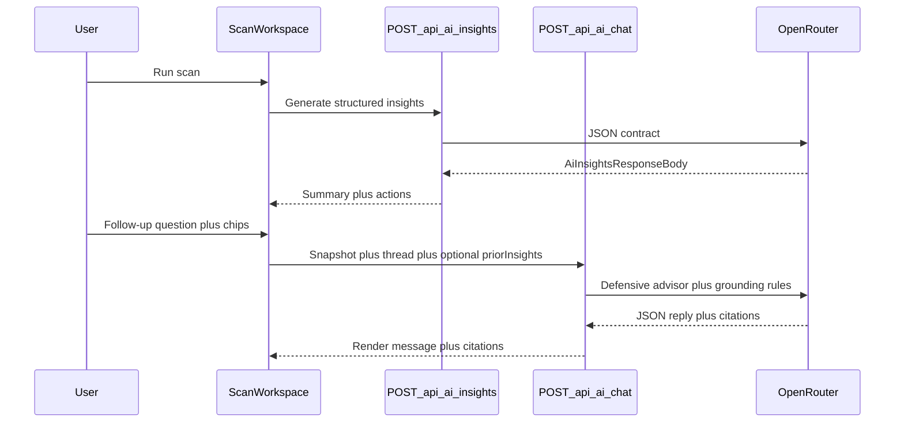

# PRD: AI Insights Guided Chat (Refinement After Scan)

**Status:** Draft (documentation only — no implementation commitment in this doc)  
**Owner:** Product / engineering (Hack LATAM)  
**Last updated:** 2026-05-17  
**Related:** [Def/Acc alignment & scoring plan](defacc-alignment-and-scoring-plan.md), [Threat model](threat-model.md), [Architecture](architecture.md)

---

## 1. Summary

Add an optional **guided conversational layer** under the existing **AI Insights** tab so SMB operators can ask follow-up questions about **their current scan snapshot** (findings, checklist rows, module status). The experience must remain **structured-first**: executive summary and prioritized actions stay primary; chat is **secondary refinement**, not a generic security assistant.

This preserves track positioning: **deterministic passive scans are the product core**; AI explains and suggests **defensive remediation and verification** only.

---

## 2. Problem statement

After `POST /api/scan`, users receive findings with plain-language explanations, but many SMB operators still need:

- Clarification of jargon-adjacent concepts (SPF, DMARC, CAA, TLS versions).
- Help prioritizing fixes given limited IT bandwidth.
- Steps they can hand to a DNS/hosting provider or MSP.
- Confidence boundaries (“what did we not check?”).

Today, **one-shot** generation via `POST /api/ai/insights` ([`src/app/api/ai/insights/route.ts`](../src/app/api/ai/insights/route.ts)) produces structured JSON (summary, `topActions`, `perFindingInsightsById`, disclaimers) per [`insights-prompt.ts`](../src/lib/ai/insights-prompt.ts). There is **no** multi-turn refinement in the UI ([`AiInsightsColumn.tsx`](../src/components/dashboard/AiInsightsColumn.tsx)); regenerating replaces the whole output.

**Gap:** Users who want iterative clarification must leave the product or re-run generation blindly.

---

## 3. Goals

| ID | Goal | Measurable signal (examples) |
|----|------|--------------------------------|
| G1 | Reduce “I don’t understand this finding” friction | Higher engagement with AI tab after first generation; optional survey |
| G2 | Keep answers **grounded in the active scan** | Citations to `finding.id` / checklist row id in responses |
| G3 | Preserve **defensive, human-in-the-loop** framing | Copy + system prompts emphasize verification; no exploit/offense |
| G4 | Avoid repositioning as “chatbot product” | Demo script still leads with modules; AI tab labeled as advisor layer |
| G5 | Control cost and abuse | Rate limits, optional auth-only chat, token budgets |

---

## 4. Non-goals

- Replacing the structured insights payload with an open-ended chat-only UI as the default.
- Real-time monitoring, intrusion detection, or “we hacked you” narratives.
- Answering questions **without** tying to the current scan context (e.g. general career advice, unrelated CVE deep-dives) unless explicitly scoped as out-of-scope with a redirect message.
- Automated remediation execution (no DNS/API writes from the assistant).
- Guaranteeing completeness or compliance — same disclaimers as today, reinforced per turn if needed.

---

## 5. Personas & primary use cases

| Persona | Need |
|---------|------|
| SMB owner / office manager | “What should I do Monday morning?” |
| IT generalist | Steps to verify DMARC/SPF/CAA/TLS in their stack |
| MSP reviewing a client export | Short rationale to paste into a ticket |

**Core use cases:**

1. **Explain finding X** — grounded in `ScanFinding.id`.
2. **Reprioritize** — given budget/time, what order of fixes (still tied to findings).
3. **Verify** — how to confirm or disprove a finding internally.
4. **Handoff** — bullet list for DNS/hosting provider (Spanish/English per locale).
5. **Scope check** — what quick vs deep scan did *not* cover (aligned with prompt mode blocks in `getInsightsSystemPrompt`).

---

## 6. Current technical context (as-is)

**Scan:** [`POST /api/scan`](../src/app/api/scan/route.ts) → `runScanModules` → `ScanResponseBody`.

**Insights:** Client builds minimal payload in [`ScanWorkspace.tsx`](../src/components/scan/ScanWorkspace.tsx) (findings slice, modules, optional checklist rows, hostname counts — **not** bulk hostname lists to the model per comment in types).

**Model contract:** System prompt requires **JSON-only** output with fixed shape (`AiInsightsResponseBody`). Parsing in [`parseInsightsModelOutput`](../src/lib/ai/insights-prompt.ts).

**Persistence:** Convex `aiInsightsCache` / `updateScanInsights` exist but are **not** wired from the Next insights route per [alignment doc §4.2](defacc-alignment-and-scoring-plan.md).

---

## 7. Product requirements

### 7.1 UX / IA

- **Primary panel (unchanged conceptually):** Executive summary, top actions, disclaimers, regenerate controls — as today.
- **Secondary panel:** “Refinar” / “Ask follow-ups” — suggested **chips** (e.g. “Explain critical findings”, “What to verify first”, “What quick scan skipped”) plus free-text input.
- **Optional:** Clicking a finding in Findings/Checklist could pre-fill context (“Question about: [title]”).
- **Empty state:** Chips visible only after initial insights exist **or** after scan completes (product decision: allow chat without generating summary first — see §11).

### 7.2 Behavioral requirements

- Every assistant reply must:
  - Stay **defensive** (remediation, verification, prioritization); refuse exploitation/offense (reuse rules from [`insights-prompt.ts`](../src/lib/ai/insights-prompt.ts)).
  - Prefer referencing **finding IDs** or checklist keys when applicable.
  - Include **disclaimer reminder** when the user asks for certainty (“passive/incomplete”).
- **Quick vs deep:** If `scanMode === "quick"`, assistant must not imply full subdomain coverage or checklist completeness (mirror existing prompt behavior).

### 7.3 Safety & abuse

- Rate limit chat endpoint (per IP / per user if Clerk session available).
- Cap message length and conversation turns per session (configurable).
- Log minimal metadata for debugging (no raw secrets); align with [privacy-and-data-sources.md](privacy-and-data-sources.md).

### 7.4 Localization

- UI strings may stay Spanish-first to match current dashboard; model replies: Spanish default or user-selectable (open question §11).

---

## 8. Implementation options

Below are **mutually comparable** approaches. Teams can ship **Option A** first and evolve toward B or C.

### Option A — New endpoint, JSON-only chat turns (recommended MVP)

- **Route:** e.g. `POST /api/ai/chat` (name TBD).
- **Request body:** `{ scanSnapshot: AiInsightsRequestBody | subset, priorInsights?: AiInsightsResponseBody, messages: Array<{ role, content }> }` — last user message is the question.
- **Response:** Strict JSON, e.g. `{ reply: string, citedFindingIds?: string[], disclaimers?: string[] }` — parse with Zod or similar.
- **Pros:** Symmetric with existing JSON discipline; easy to render citations in UI; straightforward to test.
- **Cons:** Need new prompt + parser; multi-turn token usage grows with full snapshot repeated unless trimmed.

**Mitigation:** Send **minimal** snapshot each time (same fields as insights today); optionally truncate long `explanation` fields or cap findings count with “+ N more omitted — ask about a specific id.”

### Option B — Extend `/api/ai/insights` with `mode: "chat"`

- Single route branches on `mode`: `"generate"` (current) vs `"chat"`.
- **Pros:** One URL for “AI”; shared validation of scan payload.
- **Cons:** Larger handler; risk of conflating two contracts in one file; harder OpenAPI/docs clarity.

### Option C — Streaming SSE/WebSocket

- Stream assistant tokens for perceived latency.
- **Pros:** Better UX for long answers.
- **Cons:** More infra complexity; still need final structured block if citations required — hybrid “stream prose + footer JSON” is fiddly.

**Recommendation:** MVP without streaming (Option A non-streaming); add streaming later if latency hurts.

### Option D — Client-only orchestration with existing insights only

- No new endpoint: user questions appended locally and entire thread sent to a thin wrapper — **not recommended** without server-side policy enforcement and rate limits.

### UI state storage

| Approach | Description |
|----------|-------------|
| **Session-only (React state)** | Simplest; lost on refresh |
| **sessionStorage** | Survives refresh within tab |
| **Convex thread** | Persist per scan/user when scan persistence is wired (aligns with Tier B in alignment doc) |

---

## 9. Data flow (target)

---

## 10. Prompting strategy (high level)

- **System:** Extend current defensive rules from [`insights-prompt.ts`](../src/lib/ai/insights-prompt.ts); add “only answer from provided scan JSON” and “if unknown, say what data is missing.”
- **User:** Include `INPUT_JSON` equivalent + optional `PRIOR_INSIGHTS_JSON` + last question.
- **Output:** JSON schema with `reply` (markdown allowed inside string **only if** XSS-safe rendering — prefer plain text or sanitize).
- **Regression:** Golden tests with fixture scans (quick vs deep, empty findings edge case).

---

## 11. Open questions

1. **Must user generate one-shot insights before chat?** (Recommended: yes — establishes baseline “disclaimers” + actions.)
2. **Auth gate:** Chat only when signed in vs same as scan API exposure — aligns with abuse stance in alignment doc §5.
3. **Convex:** Persist threads when `createScan` / `updateScanInsights` are wired, or stay ephemeral until then?
4. **Caching:** Separate cache key for `{ snapshotHash, questionNormalized }` vs no cache for chat (likely no cache at MVP).
5. **Export:** Include Q&A in future Markdown/PDF export (Tier B roadmap)?

---

## 12. Rollout & documentation checklist

- [ ] Update [api-reference.md](api-reference.md) when route exists.
- [ ] Update [user-guide.md](user-guide.md) — “AI tab” section with follow-ups.
- [ ] Demo narrative in [defacc-alignment-and-scoring-plan.md §6](defacc-alignment-and-scoring-plan.md): add half-sentence on guided questions **after** showing structured output.
- [ ] `.env.example` — only if new env vars (unlikely if reusing OpenRouter).

---

## 13. Success criteria (launch bar)

- Structured insights unchanged or strictly improved (no regression on `POST /api/ai/insights`).
- Chat replies refuse offensive requests in spot-checks.
- p95 latency acceptable for SMB demo (target TBD; measure after MVP).
- Rate limit prevents trivial abuse of OpenRouter spend.

---

## 14. Revision log

| Date | Change |
|------|--------|
| 2026-05-17 | Initial PRD (docs-only). |
