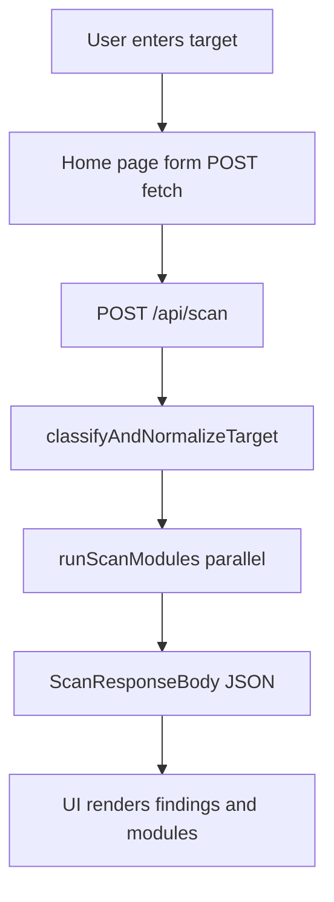

# Architecture

## Stack

- **Next.js** (App Router) + **TypeScript**
- **Tailwind CSS** v4
- **React 19**

Key entry points:

| Area | Path |
|------|------|
| Home / scan form UI | [`src/app/page.tsx`](../src/app/page.tsx) |
| Scan API | [`src/app/api/scan/route.ts`](../src/app/api/scan/route.ts) |
| Module runner | [`src/lib/recon/run-scan.ts`](../src/lib/recon/run-scan.ts) |
| Target parsing | [`src/lib/recon/normalize-target.ts`](../src/lib/recon/normalize-target.ts) |
| Subdomain recon | [`src/lib/recon/subdomains.ts`](../src/lib/recon/subdomains.ts) |
| DNS email-auth checks | [`src/lib/recon/dns-health.ts`](../src/lib/recon/dns-health.ts) |
| TLS certificate inspection | [`src/lib/recon/tls-check.ts`](../src/lib/recon/tls-check.ts) |
| Shared types | [`src/types/scan.ts`](../src/types/scan.ts) |

## Request flow

## Scan pipeline (today)

1. **Parse JSON body** — invalid JSON → `400` + `"Invalid JSON body."`.
2. **Extract `target`** string (or treat as empty).
3. **`classifyAndNormalizeTarget`** — if `unknown` or empty → `400` with user-facing message.
4. **`runScanModules`** — for each registered module:
   - If the module does not apply to `inputKind` (e.g. IP-only targets) → `ScanModuleResult` with `status: "skipped"` + reason; **no** findings from that module.
   - Else run the module; on success attach `durationMs`; on thrown error → `status: "error"` with `errorMessage` (other modules still complete).
5. **Return** `ScanResponseBody` as JSON (**one** payload; no streaming).

## UI behavior

- Client component posts `{ target }` to `/api/scan`.
- **Modules**: status, timing, skip/error messages.
- **Findings**: sorted roughly by module (`subdomain_enum` → `dns_health` → `tls_check`). Host list for CT results; structured detail panels for DNS and TLS metadata when present.

## Future shape (not implemented)

[CONTEXT.md](../CONTEXT.md) and [init.md](../init.md) describe **streaming** partial results and a richer dashboard. The codebase still returns **one** JSON payload per request; extending would likely mean Server-Sent Events, chunked responses, or polling.

## Related

- [API reference](api-reference.md)
- [Recon modules](recon-modules.md)
