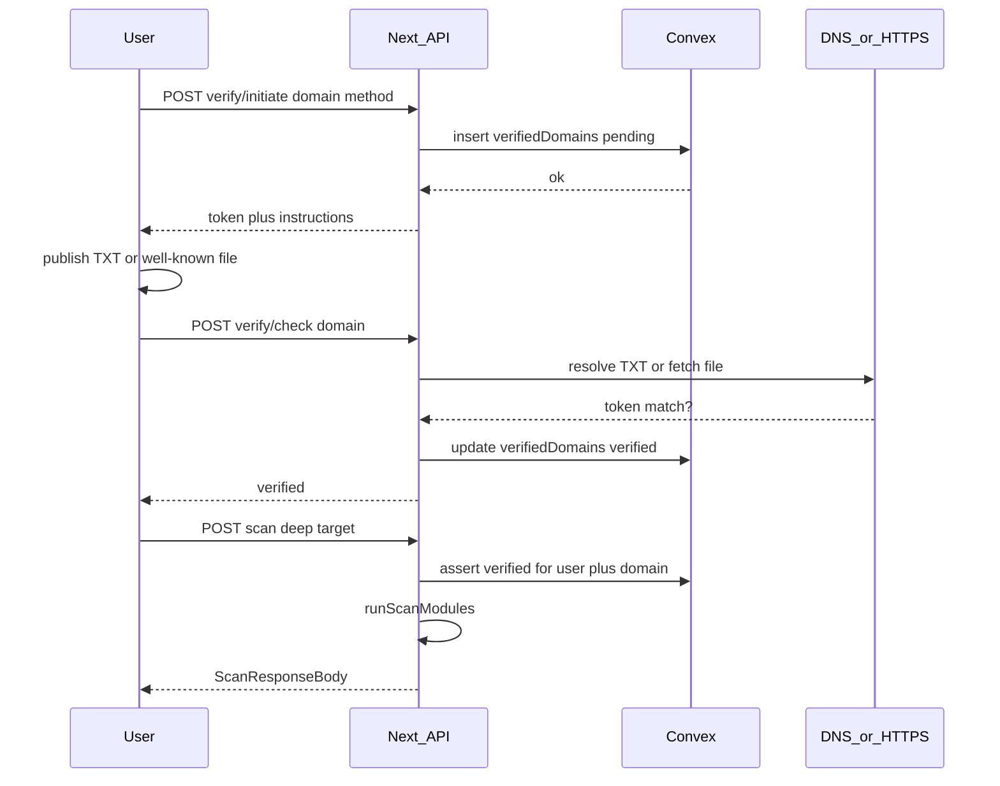

# PRD: Domain ownership verification before deep scans

| Field | Value |
|-------|-------|
| **Status** | Draft — documentation only (not implemented) |
| **Owner** | Product / engineering |
| **Related** | [threat-model.md](threat-model.md), [defacc-alignment-and-scoring-plan.md](defacc-alignment-and-scoring-plan.md), [architecture.md](architecture.md), [api-reference.md](api-reference.md) |

---

## 1. Summary

Introduce **proof of domain ownership** as a prerequisite for **`deep`** scans (certificate transparency subdomain enumeration, TLS version probes, SPF/DMARC detail checks, CAA), while preserving a **lower-friction path** for **`quick`** scans that rely on DNS email-auth and a single HTTPS certificate check.

Today [`POST /api/scan`](../src/app/api/scan/route.ts) accepts any normalized target without authentication, ownership proof, or enforced rate limits. That enables misuse as a lightweight reconnaissance helper against arbitrary domains — inconsistent with “authorized targets only” positioning ([threat-model.md](threat-model.md), [defacc-alignment-and-scoring-plan.md](defacc-alignment-and-scoring-plan.md) §5).

---

## 2. Problem statement

### 2.1 Current behavior

- **Open API.** Any client can call `POST /api/scan` with `{ target, mode }`; successful normalization triggers [`runScanModules`](../src/lib/recon/run-scan.ts).
- **Deep mode signal density.** Deep scans include [`subdomain_enum`](../src/lib/recon/subdomains.ts) (crt.sh footprint), [`tls_versions_check`](../src/lib/recon/tls-versions-check.ts), [`dns_auth_details`](../src/lib/recon/dns-auth-details.ts), and [`dns_caa_check`](../src/lib/recon/dns-caa-check.ts). Together these are the most valuable for **target triage** by a malicious actor.
- **Documented gap.** Alignment memo explicitly lists abuse of open scan as a risk and suggests mitigations including auth and verification-style friction ([defacc-alignment-and-scoring-plan.md](defacc-alignment-and-scoring-plan.md) §5, Tier C “ownership friction”).

### 2.2 Why “login only” is insufficient

Authenticated identity proves **who the user is**, not **that they may scan this domain**. Ownership verification closes that gap for deep scans without pretending to stop determined attackers who can bypass the product entirely — it **raises cost**, improves **trust narrative**, and supports **auditability** (“this scan ran under user X after verification Y”).

---

## 3. Goals

| Goal | Measurable intent |
|------|-------------------|
| **G1 — Abuse resistance** | Deep scans cannot run for arbitrary domains without a completed verification flow tied to the scanning principal. |
| **G2 — SMB usability** | Legitimate owners can complete verification in minutes (DNS or HTTPS file path). |
| **G3 — Demo viability** | Quick scan remains usable for first-touch demos with explicit authorized-use UX; optional limited anonymous quick scan policy documented separately. |
| **G4 — Audit trail** | Persist verification state per user + domain for replay and compliance storytelling (Convex-backed). |

---

## 4. Non-goals

- Multi-tenant **orgs**, delegated roles, or Clerk Organizations as **required** for v1 (may compose later).
- Legal enforcement or Terms-of-Service automation beyond documenting expectations.
- Bot detection / CAPTCHA / full abuse SOC (may pair with rate limiting PRD).
- Proving control of **individual subdomains** separately from apex domain (unless explicitly extended).

---

## 5. Users and scenarios

| Persona | Need |
|---------|------|
| **SMB operator** | Run deep scan on **their** domain after proving DNS or web hosting control. |
| **Trainer / hackathon demo** | Fast **quick** scan on an approved demo domain or signed-in flow without blocking the narrative. |
| **Malicious actor** | Enumerate weak third-party targets via product API — **should fail** at deep scan without verification + quotas. |

---

## 6. Tiered access model

Aligned with existing [`quick` / `deep`](../src/lib/recon/run-scan.ts) semantics.

| Tier | Authentication | Ownership verification | Modules / capabilities |
|------|----------------|-------------------------|-------------------------|
| **T0 — blocked** | No session | — | No scans (redirect to sign-in), *unless* product policy explicitly allows rate-limited anonymous quick — see §11 |
| **T1 — quick** | Signed in (Clerk) | Not required | As today’s **quick**: `dns_health`, `tls_check`; skips CT enum and deep-only modules; filters `low` severity findings |
| **T2 — deep** | Signed in | **Required** for `normalizedTarget` | Full **deep** pipeline: all six modules including `subdomain_enum`, `tls_versions_check`, etc. |

**IP-only targets:** Existing modules skip domain-centric checks when `inputKind === "ip"` ([run-scan.ts](../src/lib/recon/run-scan.ts)). Ownership verification applies to **domain** targets only; policy for raw IP deep scans should either remain disabled or require a separate justification — **open decision** (§11).

---

## 7. Verification methods (implementation options)

### 7.1 Option A — DNS TXT record (**recommended primary**)

**Mechanism**

1. Server generates a cryptographically random token per `(userId, apexDomain)` verification attempt.
2. User publishes TXT at **`_hack-latam-verify.<apexDomain>`** with value equal to the token (exact string match after trimming whitespace).
3. Server resolves TXT via Node `dns` (same ecosystem as [dns-health.ts](../src/lib/recon/dns-health.ts)).

**Pros**

- Industry-standard pattern (site verification, ACME DNS-01 familiarity).
- Works without HTTP listener on the domain.
- Strong **domain-level** proof.

**Cons**

- DNS propagation latency (minutes to hours).
- Users without DNS console access need another party to add the record.

### 7.2 Option B — HTTP well-known file (**recommended secondary**)

**Mechanism**

1. Same token generation.
2. User serves plaintext file at **`https://<apexDomain>/.well-known/hack-latam-challenge.txt`** containing **only** the token (exact match).
3. Server performs HTTPS `fetch` with strict timeout; optionally pin redirect depth.

**Pros**

- Often faster than DNS for developers with deploy access only.

**Cons**

- Requires working HTTPS (or documented HTTP fallback policy — discouraged).
- Fails for mail-only / parked domains without web servers.

### 7.3 Option C — HTML meta tag (**documented alternative, not recommended for v1**)

**Mechanism**

- Token in `<meta name="hack-latam-site-verification" content="<token>">` on fetched HTML.

**Pros**

- No separate file path.

**Cons**

- Fragile for SPAs / client-rendered shells.
- Parsing complexity and broader SSRF / redirect abuse surface.

### 7.4 Recommendation

Ship **A + B**: user selects method at initiation; stored record tracks `method`. Verification job checks the applicable mechanism.

---

## 8. Functional requirements

| ID | Requirement |
|----|-------------|
| **FR-1** | Given an authenticated user and domain `D`, system can create a **pending** verification with unique token and instructions for method A or B. |
| **FR-2** | Given pending verification, user can trigger **check**; system updates status to **verified** or leaves **pending**/marks **failed** with reason. |
| **FR-3** | **`POST /api/scan`** with `mode: "deep"` **must** succeed only if `(userId, normalizedTarget)` has **verified** status for apex domain policy (see §8.1). |
| **FR-4** | **`POST /api/scan`** with `mode: "quick"` requires authentication per tier table unless explicit anonymous exception policy is adopted. |
| **FR-5** | Users can list and revoke verifications (management UI — backlog). |
| **FR-6** | Errors must be actionable (“Add TXT at …”, “Expected file content …”). |

### 8.1 Apex domain normalization

Verification should bind to **registrable domain / apex** where feasible (e.g. `www.example.com` → verify `example.com`) using the same normalization primitives as scanning ([normalize-target.ts](../src/lib/recon/normalize-target.ts)). Document edge cases (public suffix list, multi-tenant subdomains) in implementation phase.

---

## 9. Technical design

### 9.1 Data model (Convex)

New table **`verifiedDomains`** (proposal):

```typescript
verifiedDomains: defineTable({
  userId: v.string(),
  domain: v.string(), // normalized apex or scan domain — finalize in implementation
  method: v.union(v.literal("dns_txt"), v.literal("http_file")),
  token: v.string(),
  status: v.union(
    v.literal("pending"),
    v.literal("verified"),
    v.literal("failed"),
  ),
  verifiedAt: v.optional(v.number()),
  lastCheckedAt: v.optional(v.number()),
  failureReason: v.optional(v.string()),
  createdAt: v.number(),
})
  .index("by_user", ["userId"])
  .index("by_user_domain", ["userId", "domain"]);
```

**Optional scan audit field:** When wiring [`createScan`](../convex/scans.ts), add `domainVerifiedAtScan: v.optional(v.boolean())` (or timestamp) on [`scans`](../convex/schema.ts) to snapshot policy compliance at scan time — recommended for historical accuracy if verification later expires or is revoked.

### 9.2 API surface (Next.js App Router)

| Endpoint | Auth | Purpose |
|----------|------|---------|
| `POST /api/verify/initiate` | Clerk session | Body: `{ domain, method }`. Creates pending record + returns token + human-readable instructions. |
| `POST /api/verify/check` | Clerk session | Body: `{ domain }`. Runs DNS or HTTPS validation; updates Convex row. |
| `GET /api/verify/status` | Clerk session | Query: `domain`. Returns current status for UX polling (optional if mutations return enough state). |

**Modified**

| Endpoint | Change |
|----------|--------|
| `POST /api/scan` | Before `runScanModules`, if `mode === "deep"`: resolve Clerk `userId`, verify Convex row exists with `status === "verified"` for normalized domain; else `403` with structured error code e.g. `OWNERSHIP_REQUIRED`. |

Implementation detail: Next routes call Convex via HTTP client or server helpers — follow patterns established when Convex scan persistence is wired ([architecture.md](architecture.md)).

### 9.3 Sequence (deep scan happy path)



---

## 10. UX specification (high level)

```
ScanWorkspace / form
├── Mode: quick
│   └── Requires sign-in (T1) → POST /api/scan mode=quick
└── Mode: deep
    ├── If domain verified for user → POST /api/scan mode=deep
    └── Else inline “Verify ownership” panel
        ├── Tab / radio: DNS TXT vs HTTPS file
        ├── Copy instructions + “I’ve published this — Check now”
        └── On verified → auto-submit deep scan (or enable submit button)
```

**Future:** Dedicated **`/settings/verified-domains`** page: table of domains, status, re-verify, revoke.

Copy must reinforce [authorized-use framing](threat-model.md): verification does not authorize intrusion testing beyond passive checks described in [recon-modules.md](recon-modules.md).

---

## 11. Security and abuse considerations

| Topic | Guidance |
|-------|----------|
| **Token entropy** | Use `crypto.randomBytes(32)` (or equivalent) — hex or base64url; reject short tokens. |
| **Server-side enforcement** | Never trust client-only “verified” flags; gate **always** in `/api/scan` server path. |
| **Rate limiting** | Independent buckets for `/api/verify/check` and `/api/scan` per IP + userId ([defacc-alignment-and-scoring-plan.md](defacc-alignment-and-scoring-plan.md) Tier B). |
| **HTTP fetch SSRF** | Strict timeouts; limit redirects; HTTPS-only option; validate response body size; compare token only — no HTML parsing unless Option C is explicitly enabled later. |
| **DNS amplification** | Throttle concurrent checks per user; backoff on repeated failures. |
| **Revocation / expiry** | Domains change hands — support periodic re-verification (recommended **90-day** TTL with warning UX). |
| **Anonymous quick scan** | If allowed for hackathon: **strict** IP quota + CAPTCHA consideration — document as policy toggle, default conservative post-demo. |

---

## 12. Success metrics (post-implementation)

- Deep scans attempted without verification → **0** allowed (monitor `403 OWNERSHIP_REQUIRED`).
- Median time from initiate → verified (DNS vs HTTPS cohorts).
- Support burden: failed verification tickets / retries.

---

## 13. Rollout phases

| Phase | Scope |
|-------|------|
| **P0 — Docs** | This PRD + threat-model delta when implementing. |
| **P1 — Backend** | Convex schema + initiate/check + scan gate for deep only. |
| **P2 — UI** | Inline verification panel + errors. |
| **P3 — Hardening** | Rate limits, expiry, management page, audit fields on `scans`. |

---

## 14. Open questions

1. **Verification TTL:** Mandatory re-verify after N days? **Recommendation:** yes (~90 days), soft-warning before hard-block.
2. **Anonymous quick scan:** Needed for funnel vs locked-down demo? **Recommendation:** optional IP rate limit only if product insists — otherwise require sign-in for all scans.
3. **Deep scan on raw IP:** Allow without domain verification or disallow deep for `inputKind === "ip"`?
4. **Subdomain vs apex:** Verify apex only and allow deep scan on any subdomain under it, or require exact hostname match?
5. **`scans` table:** Add `domainVerified` / timestamp at persistence time for audit?

---

## 15. Appendix: Code references

| Artifact | Path |
|----------|------|
| Scan route | [`src/app/api/scan/route.ts`](../src/app/api/scan/route.ts) |
| Module registry | [`src/lib/recon/run-scan.ts`](../src/lib/recon/run-scan.ts) |
| Target normalization | [`src/lib/recon/normalize-target.ts`](../src/lib/recon/normalize-target.ts) |
| Convex schema | [`convex/schema.ts`](../convex/schema.ts) |
| Clerk ↔ Convex auth | [`convex/auth.config.ts`](../convex/auth.config.ts) |

---

## 16. Revision log

| Date | Change |
|------|--------|
| 2026-05-17 | Initial PRD from Domain Ownership Verification plan. |
