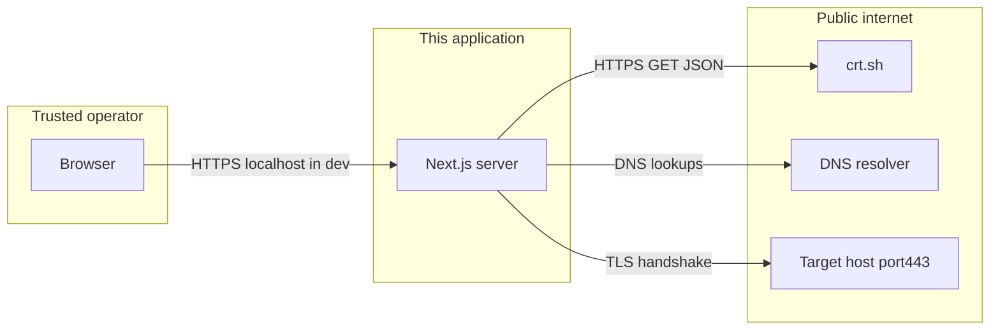

# Threat model

## Purpose of this app

Provide **authorized** users (typically **asset owners** or **trainers**) a **passive** view of information already discoverable about a domain — framed for **SMB resilience** (hackathon **def/acc** track), not for unauthorized reconnaissance.

## Trust boundaries

- **User → app:** form input and HTTP API to `POST /api/scan`. Treat logs and screenshots as potentially sensitive if they contain customer domains.
- **App → crt.sh:** server-side `fetch`; query embeds the **normalized domain** (see [Privacy & data sources](privacy-and-data-sources.md)).
- **App → DNS:** Node `dns` resolution (resolver path depends on server OS / hosting).
- **App → target:** outbound **TLS on port 443** to read the leaf certificate (**no exploitation** intent).

## Assets we protect

- **Operator reputation** — misuse could harm the project or users.
- **Subject privacy** — domains and derived hostnames are **business identifiers**.
- **Availability** — reliance on free public APIs (crt.sh) and outbound connectivity means scans can fail or slow down; not a security property but an operational one.

## Threats and mitigations (proportionate for a demo)

| Threat | Mitigation / stance |
|--------|---------------------|
| **Abuse as a bulk scanning / harassment tool** | Document “authorized targets only”; do not market for attacking third parties; consider rate limits / auth in production. |
| **Misinterpretation (“green = safe”)** | Plain-language caveats: passive data is **incomplete**; see [User guide](user-guide.md). |
| **Supply chain / API tampering** | Use HTTPS to crt.sh; validate HTTP status and JSON shape; surface errors to UI instead of failing silently. |
| **Injection via user “target” field** | Input is normalized to domain/IP; still treat external API/TLS/cert data as **untrusted** (parse defensively). |

## What we explicitly do **not** claim

- No exploitation, no credential stuffing, no volumetric probing of arbitrary hosts beyond **normal** DNS lookups, **one** crt.sh query per domain scan, and a **single** outbound TLS handshake to **443** for certificate inspection ([Recon modules](recon-modules.md)).
- Not a replacement for professional security assessment or compliance.

## “Non-intrusive” statement

The UI stresses passive scans: **certificate transparency**, **DNS email-auth lookups**, and a **single TLS handshake** to read HTTPS certificate metadata — no authentication bypass, no payload delivery, no multi-port pounding from this codebase.

## Related

- [Privacy & data sources](privacy-and-data-sources.md)
- [Overview](overview.md)
